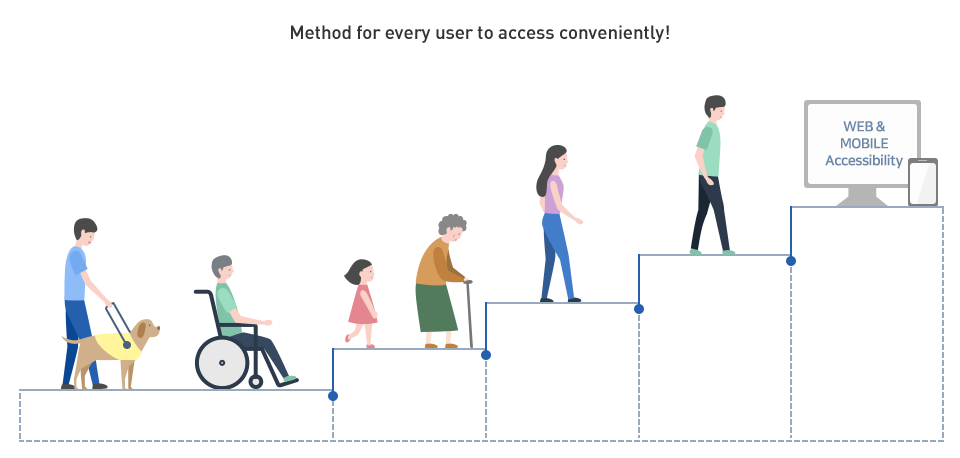
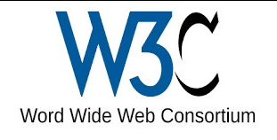

# 웹 접근성

&nbsp; 웹 개발에 있어서 **웹 접근성** 이라는 말은 빠지지 않고 등장한다. 특히, 필자는 사용자에게 화면을 보여주는 클라이언트 개발을 공부하고 있기 때문에, **웹 접근성**은 항상 빠지지 않고 거론되며, 좋은 개발자가 되기 위한 덕목 중 하나로 여겨진다.<br>

&nbsp; 그래서, 접근성이란 무엇이고, 더 나아가 웹 접근성이란 무엇일까?

## 정의

<div align='center'>

</div>

- 접근성
  > 사용자의 신체적 특성이나, 지역, 나이, 지식 수준, 기술, 체험과 같은 제한 사항을 고려하여 **가능한 많은 사용자가 불편 없이 이용**할 수 있도록 제품, 서비스를 만들어 제공하고 이를 평가할 때 쓰이는 용어
- 웹 접근성
  > **장애인이나 고령자분들이 웹 사이트에서 제공하는 정보를 비장애인과 동등**하게 접근하고 이용할 수 있도록 보장하는 것, 웹 접근성 준수는 법적의무사항이다.

&nbsp; 접근성과 웹 접근성의 정의를 살펴보니 생기는 의문점이 하나있다. 웹 접근성의 정의는 접근성의 정의와는 다르게 신체적 특성, 나이에만 국한되어있다. 왜 그럴까?<br><br>
&nbsp; 접근성의 정의에서 고려해야하는 지역, 지식 수준, 기술 체험과 같은 제한 사항을 극복하게 해준 것이 **웹의 힘**이다. **웹은 데스크톱, 노트북, 스마트폰만 있다면 시공간의 제약 없이 누구나 동등한 서비스를 이용할 수 있다.**<br><br>
&nbsp; 이제는 **장애인이나 고령자분들도 동등하게** 웹 서비스를 사용할 수 있도록 웹 접근성을 준수하는 것이 웹 개발자들의 몫이다.

## 접근성을 위한 개발?

<div align='center'>

</div><br>

&nbsp; 웹 표준, 웹 접근성을 개발하고 장려하는 세계적인 기관인 **W3C**는 여러가지 방안을 제시한다.<br><br>
&nbsp; 그렇다면 접근성을 위한 개발에는 어떠한 것들이 있을까?

### 1. IR 기법 (Image Replacement)

&nbsp; **이미지를 볼 수 없는 사용자에게 적절한 대체 텍스트를 제공**하는 것, 해당 기법을 통해서 시각 장애인은 이미지를 보지 못하더라도 설명을 귀로 들을 수 있다.<br>
&nbsp; 기업마다 사용하는 방식에는 차이가 있다. 카카오와 네이버가 사용하는 방식을 소개한다.

```css
/* 카카오 */
.ir_pm {
  display: block;
  overflow: hidden;
  font-size: 1px;
  line-height: 0;
  text-indent: -9999px;
}
/* 네이버 */
.blind {
  position: absolute;
  clip: rect(0 0 0 0);
  width: 1px;
  height: 1px;
  margin: -1px;
  overflow: hidden;
}
```

&nbsp; 해당 클래스명을 가진 태그의 텍스트는 화면 상에 보이지 않지만, 스크린 리더가 이를 읽어주고 정보를 수집한다.

### 2. 이미지에 캡션 적용

&nbsp; 이미지에 무조건 IR기법을 사용할 필요는 없다. 이미지를 설명하는 대체 텍스트가 짧다면 이미지 태그의 `alt` 속성에 설명을 기입하는 방법도 있다.

```html

```

### 3. 키보드로 모든 기능을 사용할 수 있도록 적용

&nbsp; 웹 접근성을 향상시키기 위해서는 마우스 뿐만 아니라 키보드로도 모든 기능을 사용할 수 있도록 해야한다. 예시로는 `onclick` 이벤트로 발생하는 것을 `keyup` 으로도 발생시키도록 지정하는 방식 등이 있다.

## 접근성을 위한 개발을 꼭 해야할까?

&nbsp; 필자의 머리를 띵하게 만든 웹 창시자의 명언이 있다.<br>
`웹의 힘은 그것의 보편성에 있다. 장애에 구애없이 모든 사람이 접근할 수 있는 것이 필수적인 요소이다.`<br><br>
&nbsp; 오늘날 웹이 이렇게까지 거대하게 발전할 수 있었던 것은 **보편성**이라는 매력때문이라고 생각한다. 시공간의 제약 없이 모두가 동등하게 대량의 정보에 접근할 수 있게 한 것이 웹이다.<br><br>
&nbsp; 이제는 장애인, 노인분들을 위한 접근성에 힘을 쏟을 차례이다. 항상 개발을 하면서 눈앞에 보이는 기능을 구현하기 바쁘고, 웹 접근성에 대한 것들은 생각만 하다가 우선순위를 뒤로 미루거나, 아예 하지 않은 적이 많다. 이번 포스팅을 작성하면서 많이 반성하게 되는 것 같다.<br><br>
&nbsp; 웹을 가장 강력하게 만들어주었던 접근성을 향상시키기 위한 개발을 하도록 노력해보자...!!
