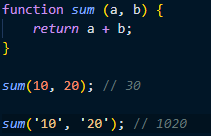
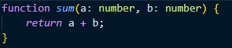
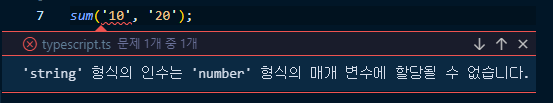
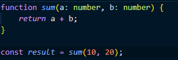

# TypeScript

## TypeScript는 무엇인가

 

`TypeScript`란 쉽게 말해서 JavaScript에 타입을 부여한 언어이다.
  
`TypeScript`는 JavaScript의 **슈퍼셋**이라고도 불리는데, JavaScript의 모든 기능을 지니면서, JavaScript의 단점을 보완하는 추가적인 기능까지 지니기 때문이다.
  
`TypeScript`는 엄청나게 각광받고 있으며, 대부분의 기업의 지원자에게 `TypeScript`의 역량을 요구하고 있다.
  
그렇다면, 왜 `TypeScript`에 이토록 개발자들이 열광하는 것일까?
  

## TypeScript를 이용한 개발을 꼭 해야 할까?
우선, `TypeScript`의 장점을 먼저 알아보자.
  
`TypeScript`의 장점들을 보면 필요성을 느낄 수 있지 않을까..?
  

### 1. `TypeScipt`는 정적 타입을 지원한다.
그래서, 뭐 어쩌라고?
  
JavaScript와 `TypeScript`로 더하기 함수를 생성하는 예시를 살펴보자.

위의 예시는 JavaScript로 `sum` 함수를 만들었다.
  

첫 번째 예시는 `sum` 함수의 의도가 정확히 작동하였다.
  

두 번째 예시는 그렇지 않다. 우리는 `sum` 함수의 인수로 숫자형 데이터가 들어가길 기대했지만, 문자열 데이터가 들어가면서 우리가 의도한 결과가 나오지 않았다.
  

이 예시는 코드가 매우 짧아서 금방 확인해서 고치면 되겠지만, 코드가 굉장히 길어지게되면 어떨까? 의도치 않은 결과가 나온 것을 확인하고, 이의 원인을 확인하고 수정하는데 **굉장히 많은 시간을 소요**할 것이다.
  

이번에는 `TypeScript`를 활용하여 전달받을 인자에 타입을 모두 숫자형으로 지정해주었다.
  

이렇게 하면 어떤 도움을 받을 수 있을까?
  

인수로 숫자형이 아닌 다른 타입을 전달하자 친절하게 에러를 발생시켜준다. **에러의 사전 방지**가 가능해졌다!
  

### 2. 친절한 가이드
`TypeScript`는 매우 친절하다. 바로 예시를 살펴보자.

좀 전의 예시와 비슷하다. `sum` 함수를 선언해주고, 결과값을 `result`라는 변수에 담아주었다.
  
`result` 변수는 당연히 숫자형 타입일 것이다. `result`에 특정 동작을 취하기 위해서 메서드를 사용해봐야겠다.

<video src="./images/auto.mp4" controls autoplay>
</video>
  

숫자형에 대한 메서드들을 친절하게 다 제공한다!
  
IDE에서 강력한 기능을 제공한다.
  
개발 속도를 좀 빠르게 가져갈 수 있다.
  

그렇다면, `TypeScript`의 단점은 무엇일까?

### 1. 속도가 느리다.
`tsc`의 속도가 느린 것은 `TypeScript`의 문제이다. `tsc`는 타입 체크를 진행한 후, 빌드를 진행하기 때문에 JavaScript에 비해 시간이 더 소요된다.
  
하지만, `TypeScript`의 이러한 고질적인 문제는 `esbuild`라는 빌드 도구가 나오면서 해결이 되었다.

### 2. 코드의 가독성이 떨어진다...?
`TypeScript`는 아무래도 모든 객체에 대한 타입을 지정해줘야 하기 때문에 코드가 길어지고, 가독성이 떨어질 수 있다는 단점이 존재한다.
  

`TypeScript`를 적용하면서 또한 수많은 에러를 마주할 가능성이 높아진다. 따라서, 모든 타입을 허용하게 하는 `any` 타입을 많이 남용하게 되고, `AnyScript`라는 별명까지 생기게 되었다.
  

그럼에도, `TypeScript`의 장점은 너무 강력하고, 큰 프로젝트의 유지보수 비용을 크게 낮춰주는 장점도 존재한다. JavaScript의 모든 기능을 가지고 있는 동시에 단점을 보완하는 기능까지 갖추고 있는 JavaScript의 **슈퍼셋**인 `TypeScript`를 굳이 안 사용할 이유는 없다.
  

## TypeScript를 이용한 개발에서 중요한 것은 무엇이 있을까?
  
필자도 `TypeScript`의 경험이 매우 적기 때문에, 가지고 있는 인사이트 내에서만 중요한 점을 언급해보려고 한다.

### 1. TypeScript를 너무 큰 허들로 받아들이지 말자.
 
**TypeScript는 JavaScript의 슈퍼셋**이라는 점을 잊지 말자.
  
`TypeScript`는 새로운 언어가 아니다. 기존의 JavaScript의 코드에서 변수의 타입을 지정하는 것부터 시작해보는 것은 어떨까?
  

### 2. any 타입을 남발하지 말자.
 
필자도 React 기반의 프로젝트를 React + TypeScript로 마이그레이션 하는 과정에서 했던 실수이다.
  

기존의 프로젝트를 `TypeScript`로 리팩토링하는 작업에서는 더더욱 엄청난 에러가 발생해서 자기도 모르게 **모든 타입을 허용하는** `any` 타입을 남발하게 된다.
  

모든 타입을 허용하는 `any`는 `TypeScript`의 강력한 장점을 사용하지 않는 것과 마찬가지이다.