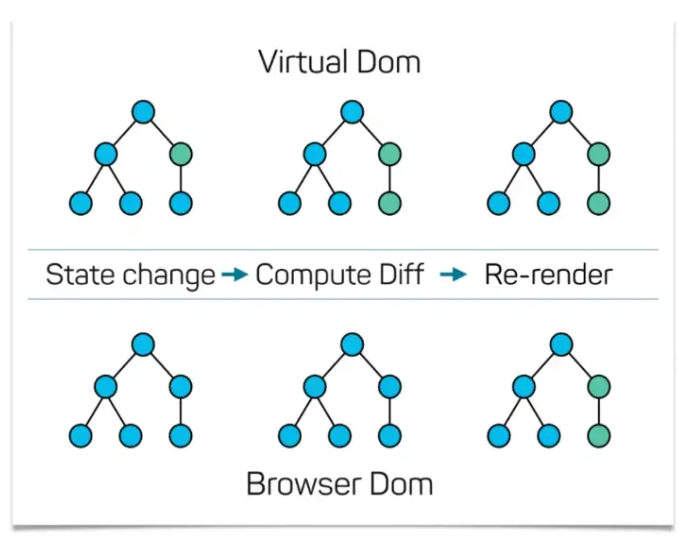

# CSR Framework, Library 비교

## 각 Framework, Library의 주된 차이점

### 1. `Virutal DOM` vs `Real DOM`

우선 `Virutal DOM`과 `Real DOM`이 무엇인지부터 확인해보자.
  

- ## `Virtual DOM`

  `Virtual DOM`이란 직역하면 가상 DOM으로, 실제 DOM에서 처리하는 방식이 아닌 `Virtual DOM`과 메모리에서 미리 처리를 하고, 실제 DOM과 다른 점을 비교해서 **딱 한 번의** 렌더링이 발생한다.

   

  흔히들 말하는 `Virtual DOM`의 특징은 직접적인 DOM 조작 시에 발생하는 비효율적인 렌더링 문제를 해결해준다.

  

  
  

    

- ## `Real DOM`

  `Real DOM`은 말그대로 가상 DOM이 아닌 브라우저의 실제 DOM Tree를 조작하는 방식이다.

|   `Virtual DOM`    | `Real DOM` |
| :----------------: | :--------: |
| React, Vue, Svelte |  Angular   |

 

### 2. 검색 엔진 최적화를 위한 서버 사이드 렌더링 지원 여부

 

React, Vue, Angular, Svelte 모두 `SPA`를 위한 프레임워크 및 라이브러리이다.
  

하지만, Single Page Application의 치명적인 단점 중 하나는 검색 엔진 최적화에 매우 취약하다는 점이다.
  

따라서, 개발을 진행할 때 전통적인 방식인 `Server Side Rendering` 방식과 `Client Side Rendering` 방식을 혼합하여 개발한다.
  

Angular의 `Real DOM`은 `SPA`에서 매우 효율적이지만, `Server Side Rendering`을 지원하지 않는다는 치명적인 단점을 가지고 있다.
  

|           `SSR 지원 O`           | `SSR 지원 X` |
| :------------------------------: | :----------: |
| React (Next), Vue (Nuxt), Svelte |   Angular    |

 

## 스타트업을 창업한다면, 어떠한 것을 사용하는 것이 좋을까?

 

스타트업 창업 단계에서는 `Vue` 프레임워크를 사용하는 것이 좋은 선택이라고 생각한다.
  

1. `Vue` 프레임워크는 러닝커브가 매우 낮다. 그렇다고 `React`, `Angular`에 비해 기능이 떨어지는 것도 아니다. 서버 사이드 렌더링을 지원하고, `React`와 마찬가지로 앱도 제작할 수 있다.

2. 라이브러리인 `React`에 비해, 프레임워크인 `Vue`는 프레임워크에 익숙하기만 하면 틀이 어느정도 정해져있기 때문에 굉장히 빠른 개발을 진행할 수 있어서 초기 스타트업에 적절하다고 생각든다.
     

## 그렇다면, 나는 왜 React를 학습하고 있는가?

 

위에서 설명한 `Vue`의 장점들을 뒤로하고, `React`를 학습하는 이유는 다음과 같다.

## 압도적인 점유율

- 취업준비생 입장에서는 1번의 이유가 굉장히 중요하게 작용한다. 압도적인 점유율을 지닌다는 뜻은 취업시장에서 더 확률이 높다는 뜻이기도 하다.
- 또한, 압도적인 점유율은 곧 압도적인 커뮤니티로 이어지기도 하다. 커뮤니티가 활성화되어있다는 것은 우리들과 같은 주니어 개발자들이 공부하기 용이하다는 뜻이기도 하다.
