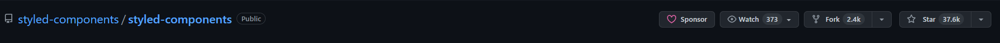

# CSR Framework, Library 비교

## 각 Framework, Library의 주된 차이점

### 1. `Virutal DOM` vs `Real DOM`

우선 `Virutal DOM`과 `Real DOM`이 무엇인지부터 확인해보자.
<br><br>

- ## `Virtual DOM`

  `Virtual DOM`이란 직역하면 가상 DOM으로, 실제 DOM에서 처리하는 방식이 아닌 `Virtual DOM`과 메모리에서 미리 처리를 하고, 실제 DOM과 다른 점을 비교해서 **딱 한 번의** 렌더링이 발생한다.

  <br>

  흔히들 말하는 `Virtual DOM`의 특징은 직접적인 DOM 조작 시에 발생하는 비효율적인 렌더링 문제를 해결해준다.

  <div align='center'>
  
  </div>
  <br><br>

- ## `Real DOM`

  `Real DOM`은 말그대로 가상 DOM이 아닌 브라우저의 실제 DOM Tree를 조작하는 방식이다.

|   `Virtual DOM`    | `Real DOM` |
| :----------------: | :--------: |
| React, Vue, Svelte |  Angular   |

<br>

### 2. 검색 엔진 최적화를 위한 서버 사이드 렌더링 지원 여부

<br>

React, Vue, Angular, Svelte 모두 `SPA`를 위한 프레임워크 및 라이브러리이다.
<br><br>

하지만, Single Page Application의 치명적인 단점 중 하나는 검색 엔진 최적화에 매우 취약하다는 점이다.
<br><br>

따라서, 개발을 진행할 때 전통적인 방식인 `Server Side Rendering` 방식과 `Client Side Rendering` 방식을 혼합하여 개발한다.
<br><br>

Angular의 `Real DOM`은 `SPA`에서 매우 효율적이지만, `Server Side Rendering`을 지원하지 않는다는 치명적인 단점을 가지고 있다.
<br><br>

|           `SSR 지원 O`           | `SSR 지원 X` |
| :------------------------------: | :----------: |
| React (Next), Vue (Nuxt), Svelte |   Angular    |

<br>

## 스타트업을 창업한다면, 어떠한 것을 사용하는 것이 좋을까?

<br>

스타트업 창업 단계에서는 `Vue` 프레임워크를 사용하는 것이 좋은 선택이라고 생각한다.
<br><br>

1. `Vue` 프레임워크는 러닝커브가 매우 낮다. 그렇다고 `React`, `Angular`에 비해 기능이 떨어지는 것도 아니다. 서버 사이드 렌더링을 지원하고, `React`와 마찬가지로 앱도 제작할 수 있다.

2. 라이브러리인 `React`에 비해, 프레임워크인 `Vue`는 프레임워크에 익숙하기만 하면 틀이 어느정도 정해져있기 때문에 굉장히 빠른 개발을 진행할 수 있어서 초기 스타트업에 적절하다고 생각든다.
   <br><br>

## 그렇다면, 나는 왜 React를 학습하고 있는가?

<br>

위에서 설명한 `Vue`의 장점들을 뒤로하고, `React`를 학습하는 이유는 다음과 같다.

## 압도적인 점유율

- 취업준비생 입장에서는 1번의 이유가 굉장히 중요하게 작용한다. 압도적인 점유율을 지닌다는 뜻은 취업시장에서 더 확률이 높다는 뜻이기도 하다.
- 또한, 압도적인 점유율은 곧 압도적인 커뮤니티로 이어지기도 하다. 커뮤니티가 활성화되어있다는 것은 우리들과 같은 주니어 개발자들이 공부하기 용이하다는 뜻이기도 하다.
  <br><br>

# styled-components

## styled-components의 장/단점은 무엇인가?

<br>

`React` 기반 프로젝트에서 개발을 진행할 때 항상 `styled-components` 스타일 도구를 선정하였다.
<br><br>

사용하면서 느낀 `styled-components`의 장점은 다음과 같다.
<br><br>

### 1. `CSS in JS`

<br>

`styled-components`는 `CSS in JS`로 자바스크립트 환경 내부에서 개발이 된다.
<br><br>
이 뜻은, 스타일시트 파일들을 따로 유지보수할 필요가 없다는 뜻이다.
<br><br>
또한, 자바스크립트 환경 내부에서 개발하기 때문에 `React`와의 호환이 좋다. `props`를 이용한 조건부 스타일링 등 여러가지 기능을 활용할 수 있다.
<br><br>
코드가 짧다면, 컴포넌트 파일 내부에서 스타일을 선언해서 파일의 수를 줄일 수 있다.
<br><br>

### 2. 클래스명을 짓는 고통에서 벗어날 수 있다.

<br>

컴포넌트마다 클래스명을 짓는 것은 꽤나 번거롭다. 하지만 `styled-components`는 자동으로 클래스명을 랜덤하게 부여하므로, 부담을 크게 줄일 수 있다.
<br><br>

### 3. 활성화된 커뮤니티

<br>

활성화된 커뮤니티는 `styled-components`의 인기를 보여주는 수치이다. 커뮤니티가 활성화되었다는 것은, 우리가 쉽게 접하고 공부할 수 있다는 것을 뜻하기도 하다.

<div align='center'>

</div>
<br><br>

물론, 무조건 좋다고 할 수는 없다. 단점도 몇 가지 존재한다.
<br><br>

### 1. 별도의 라이브러리 설치에 따른 번들 크기 증대

```bash
$ yarn add styled-components
```

`styled-components` 라이브러리를 사용하기 위해서는 별도의 설치가 필요하다.
<br><br>

### 2. 사용자 경험 저하

<br>

기존의 `CSS in CSS`가 렌더링 이전에 CSS가 먼저 되어 방식과 다르게 `CSS in JS`는 JS 환경이기 때문에 CSS가 적용되지 않은 원형의 형태를 잠시 보게된다.
<br><br>

## 대체할 수 있는 라이브러리는?

### Emotion?

<br>

최근에 관심을 좀 가지고 살펴본 라이브러리이다. 사실 `styled-components`와 크게 다른 점은 없다.
<br><br>

둘 다 `CSS in JS`이다. 하지만, 서버 사이드 렌더링 환경에서 `emotion`의 세팅이 훨씬 수월하다.
<br><br>

하지만, 인라인 형식의 `emotion`이 좋은 지 모르겠다. 필자는 확실하게 분리된 코드를 좀 더 깔끔해서 선호한다.
<br><br>

`SSR`환경에서 `ServerStyleSheet`을 귀찮지만 세팅해주면 되지 않을까..
<br><br>

## 그래서, 어떠한 라이브러리 사용할건데?

<br>

익숙해서 인건지, 다른 라이브러리를 사용해보지 않아서 장점을 정확히 파악하지 못해서인지, 아직까지는 `styled-components`를 매우 잘 사용하고 있다.
<br><br>

`emotion`은 언젠가 프로젝트에 도입해보고 싶을지도...?
